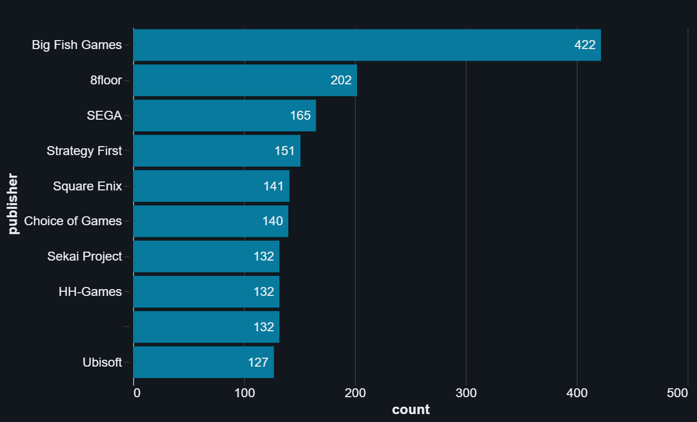
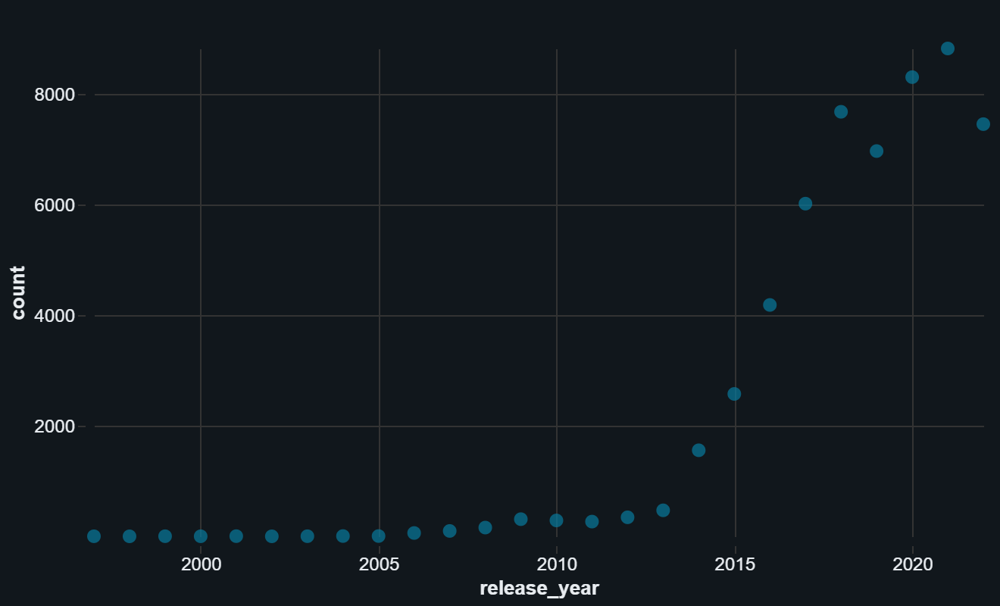
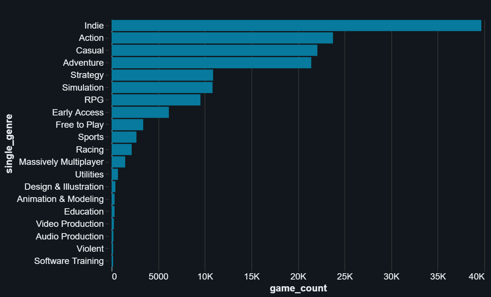
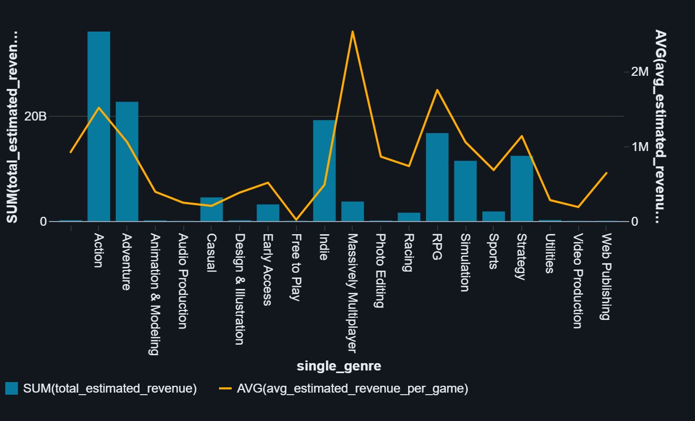

# Big Data Project: Steam Videogames Ecosystem Analysis 👾

## Project Overview
This project involves a global exploratory data analysis (EDA) of the Steam video game marketplace on behalf of a video game publisher (simulated as Ubisoft). The objective is to understand the factors driving game popularity, pricing strategies, and platform distribution using Big Data technologies.

The dataset consists of semi-structured JSON data representing over 60,000 games, processed and analyzed using **Databricks** and **PySpark**.

## Deliverable Access
* **Code & Execution:** The PySpark notebook is available in `notebooks/steam_analysis.ipynb`.
* **Visualizations & Dashboard:** Due to Databricks deprecating public notebook publishing for security reasons, the fully executed notebook (with all interactive visualizations) has been exported as an HTML file. 
* 👉 **Please download and open `assets/steam_analysis_exported.html` in any web browser to view the interactive charts. 👉[link here](https://github.com/enavarrento/dsfs-2-Big-Data-Steam/blob/main/assets/steam_analysis_exported.html)**

## Data Source
The raw data is stored in AWS S3 and ingested directly into the Databricks cluster:
`s3://full-stack-bigdata-datasets/Big_Data/Project_Steam/steam_game_output.json`

## Objectives
The analysis is divided into three core levels:
1. **Macro Analysis:** Identifying top publishers, temporal release trends (including Covid-19 impacts), pricing distributions, and age restriction demographics.
2. **Genre Analysis:** Evaluating genre representation, review ratios, publisher genre affinities, and estimating minimum gross revenue per genre.
3. **Platform Analysis:** Assessing the distribution of games across Windows, Mac, and Linux, including platform adoption rates within specific gaming niches.

## Technical Stack
* **Environment:** Databricks
* **Data Processing:** PySpark (DataFrame API, SQL Functions, Window Functions)
* **Visualizations:** Databricks Native Dashboards
* **Language:** Python

## Repository Structure

├── assets/              # Static exports of dashboards and architectural diagrams
├── notebooks/           # Core EDA Databricks notebook
├── src/                 # Modularized PySpark transformation scripts
│   ├── 01_data_preparation.py
│   ├── 02_macro_analysis.py
│   ├── 03_price_analysis.py
│   ├── 04_genre_analysis.py
│   └── 05_platform_analysis.py
├── README.md            # Project documentation
└── requirements.txt     # Local environment dependencies

## Key Technical Implementations
* **Nested Data Flattening:** Utilized PySpark's `explode()` and struct unpacking to normalize highly nested JSON arrays (e.g., tags, genres, and platforms).
* **Fault-Tolerant Parsing:** Implemented robust type-casting and conditional logic (`when().otherwise()`) to handle missing data, malformed strings, and zero-division edge cases (ANSI SQL compliance).
* **Pre-Aggregated Statistics:** Leveraged the Greenwald-Khanna algorithm (`percentile_approx`) to calculate exact boxplot statistics at the cluster level, bypassing frontend UI row limitations.

## Dashboard Previews

Below are static snapshots of the interactive Databricks dashboards developed for this analysis.

### 1. Macro Analysis: Top Publishers & Release Trends 
*Identifying the most prolific publishers on the platform and visualizing the spike in game releases over time.*

### 2. Genre Analysis: Popularity vs. Revenue
*Evaluating the most represented genres alongside proxy revenue estimates to identify lucrative market segments.*

## Execution Instructions
To run this project:
1. Import the notebook from the `notebooks/` directory into a Databricks Workspace.
2. Ensure the cluster has read-access to the specified S3 bucket.
3. Execute the cells sequentially.

---
*Developed as part of the Jedha Data Science Bootcamp (Cohort DSFS-36) - RNCP35288 Certification.*